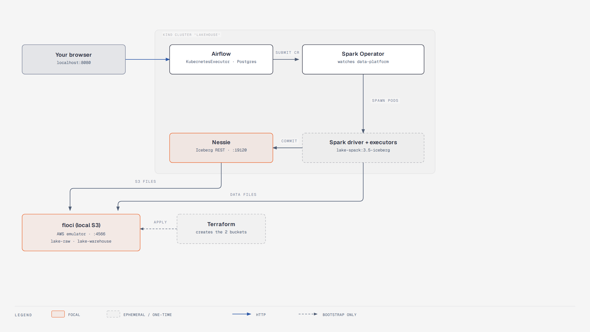
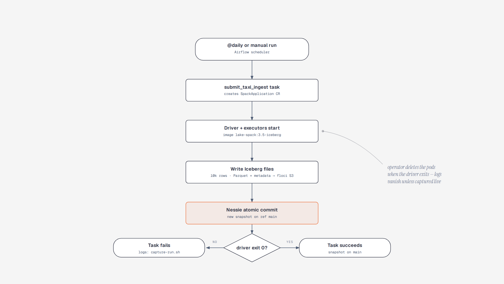
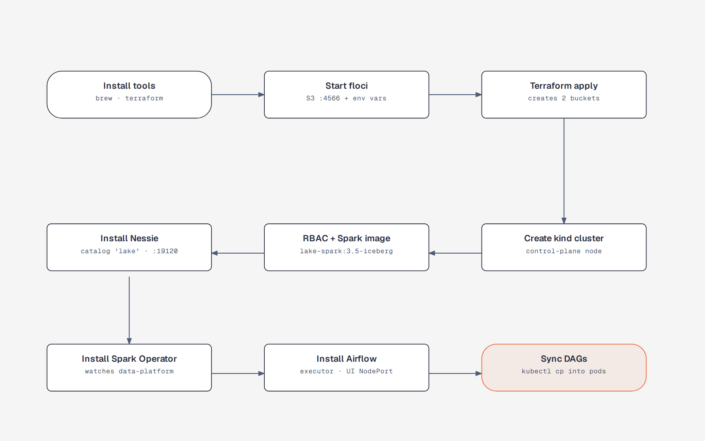

# local_aws_floci_terraform


A **complete lakehouse on your laptop** — a fake AWS, a real Kubernetes cluster, and a scheduled data pipeline that lands daily data in an Apache Iceberg lake. Everything is local, nothing costs a cent, and no cloud credentials exist.

```
floci (fake S3) → Terraform (buckets) → kind (Kubernetes) → Nessie + Spark Operator + Airflow
→ daily DAG: synthetic NYC-taxi CSV rows → Spark → Iceberg table nessie.bronze.taxi_trips
```

- **No AWS account, no bill.** All AWS-shaped behavior (`S3`, `STS`, `IAM`) comes from [floci](https://floci.io/), a LocalStack-style emulator on `localhost:4566`.
- **One command up, one command down.** `./scripts/setup.sh` builds the whole stack and is idempotent — re-run it after a Docker restart.
- **A real pipeline, not a mock.** Airflow triggers a genuine Spark job on Kubernetes that commits real Iceberg snapshots.
- **Every bug fixed is documented.** [`FIXES.md`](FIXES.md) records all 23 errors hit while bringing this up — symptom → root cause → fix.

> Diagrams in this README live in [`docs/diagrams/`](docs/diagrams/) — each one has an editable `.html` master next to its `.png`, all built with the [diagram-design](https://github.com/cathrynlavery/diagram-design) skill.

---

## 1. What you're building



Two things run side by side on your machine:

| What | Where it lives | Address |
|---|---|---|
| **floci** — fake AWS (S3 + STS + IAM) | its own Docker container | `http://localhost:4566` |
| **kind `lakehouse`** — a real Kubernetes cluster inside one Docker container | its own Docker container | — (everything below listens through it) |

Inside the kind cluster:

| Component | Namespace | Listens on |
|---|---|---|
| **Airflow** (api-server, scheduler, dag-processor, KubernetesExecutor + Postgres) | `data-platform` | `http://localhost:8080` (UI, login `admin`/`admin`) |
| **Nessie** — Iceberg REST catalog | `nessie` | `http://localhost:19120` |
| **Spark Operator** | `spark-operator` | (watches `data-platform` for `SparkApplication` manifests) |
| **Spark driver + executors** | `data-platform` | ephemeral — exist only while a run executes |

kind maps host ports to NodePorts: `host 8080 → 30080` (Airflow) and `host 19120 → 30120` (Nessie). Terraform, your browser, and the floci container all live **outside** the cluster; pods reach floci at `http://host.docker.internal:4566`.

### The cast, in plain English

| Component | What it is (and a useful way to think about it) |
|---|---|
| **floci** | A "pretend AWS" in a container: speaks the real S3/STS/IAM APIs but stores everything on your disk. Think *local test double* for the cloud. |
| **Terraform** | Writes infrastructure as code. Here it does exactly one thing: create the S3 buckets `lake-raw` and `lake-warehouse`. |
| **kind** | Kubernetes-in-Docker — a genuine tiny cluster inside a single container. |
| **Airflow** | Cron with a web UI. Defines jobs ("DAGs") as Python, schedules them, shows you green/red runs. |
| **Spark Operator** | A Kubernetes controller that turns a `SparkApplication` manifest into driver + executor pods, and cleans them up when the job ends. |
| **Iceberg** | A *table format*: turns a pile of Parquet files in S3 into a proper table — schema, partitioning, atomic commits, snapshots. |
| **Nessie** | The *catalog* Iceberg talks to — think **Git for lake tables**: it tracks which files belong to the table's latest snapshot on a branch (`main` here). |
| **bronze** | The first landing layer of the medallion pattern (bronze → silver → gold). This repo stops at bronze. |

---

## 2. The one data pipeline that actually runs



DAG `iceberg_taxi_ingest` runs **@daily** (you can also trigger it by hand, see §5). One run does this:

1. **Trigger** — the Airflow scheduler fires the run, or you trigger one manually.
2. **Submitting** — the single task `submit_taxi_ingest` (`SparkKubernetesOperator`) creates a `SparkApplication` object in K8s from the template in [`k8s/spark-application-template.yaml`](k8s/spark-application-template.yaml).
3. **Pods start** — the Spark Operator spawns a driver and one executor pod from the preloaded `lake-spark:3.5-iceberg` image, then blocks until the driver terminates.
4. **Files are written** — the job (`spark/jobs/ingest_taxi.py`) builds 10,000 synthetic taxi rows in memory and writes Parquet data files **and** Iceberg metadata JSON into `s3://lake-warehouse/wh` through floci's S3 endpoint.
5. **Commit** — the driver asks Nessie (`/iceberg/` REST, ref `main`) to atomically point the table `nessie.bronze.taxi_trips` at the new snapshot. The table is partitioned by `days(pickup_ts)`.
6. **Outcome** — driver exit code 0 → the task succeeds; anything else → the task fails. Either way the operator **deletes the `SparkApplication` and the pods**, and Airflow stops considering it executed.

> **Why the DAG is a single task:** the operator already blocks until the driver finishes and then deletes the `SparkApplication` — a follow-up sensor would always find nothing to sense (404) and fail spuriously. This is documented in [`FIXES.md`](FIXES.md) entry #23. Same for pod logs: they vanish with the pod, which is what `scripts/capture-run.sh` is for.

---

## 3. Prerequisites

- **Docker** running and your user allowed to talk to it: `sudo usermod -aG docker $USER`, then log out/in. (If `docker ps` works, you're set.)
- **Memory:** the stack was squeezed onto a 3.5 GB Docker Desktop VM, but Spark runs will OOM below ~4 GB. **5–6 GB allocated to Docker is comfortable.**
- **Tools:** `floci`, `terraform`, `kubectl`, `helm`, `kind` — one command installs all of them:

```bash
./scripts/install-tools.sh    # brew for most; Terraform comes from HashiCorp releases
```

## 4. Quickstart

```bash
./scripts/setup.sh      # builds the whole stack, ~5–10 min with downloads
./scripts/teardown.sh   # removes all of it
```

When `setup.sh` prints `DONE`, you have:

- Airflow UI: `http://localhost:8080` — login `admin` / `admin`
- Nessie API: `http://localhost:19120`
- fake S3: `http://localhost:4566` (credentials `test` / `test`)



| Step | What it does | Where the code is |
|---|---|---|
| install tools | brew-installs `floci`, `kubectl`, `helm`, `kind`; pulls Terraform 1.9.8 from HashiCorp releases | [`scripts/install-tools.sh`](scripts/install-tools.sh) |
| start floci | starts the AWS emulator, exports `env` vars pointing tools at `:4566` | `setup.sh` |
| terraform apply | creates buckets `lake-raw` + `lake-warehouse` | [`terraform/`](terraform/) |
| create kind cluster | single control-plane node with the port mappings above | [`kind/cluster.yaml`](kind/cluster.yaml) |
| RBAC + image | Airflow SAs may create `SparkApplications`; builds `lake-spark:3.5-iceberg` and loads it into kind | [`k8s/airflow-spark-rbac.yaml`](k8s/airflow-spark-rbac.yaml), [`spark/Dockerfile`](spark/Dockerfile) |
| install Nessie | Iceberg REST catalog, warehouse `lake` → `s3://lake-warehouse/wh`, creds from secret `nessie-s3-creds` | [`helm/values-nessie.yaml`](helm/values-nessie.yaml) |
| install Spark Operator | watches **only** `data-platform` (default would watch `default` and miss our apps — FIXES #3) | `setup.sh` |
| install Airflow | chart 1.22.0 (Airflow 3.2.2), KubernetesExecutor, in-cluster K8s connection, NodePort service for the UI | [`helm/values-airflow.yaml`](helm/values-airflow.yaml), [`k8s/airflow-api-server-nodeport.yaml`](k8s/airflow-api-server-nodeport.yaml) |
| sync DAGs | `kubectl cp` copies the DAG and its SparkApplication template into the **dag-processor** pod, which owns the `airflow-dags` PVC (FIXES #13) | [`dags/iceberg_ingest_dag.py`](dags/iceberg_ingest_dag.py) |

`teardown.sh` deletes the kind cluster and stops floci — **both buckets and all lake data go with it.**

## 5. Hands-on: run one pipeline

```bash
# trigger a run named "my_run"
kubectl exec -n data-platform deploy/airflow-scheduler -c scheduler -- \
  airflow dags trigger iceberg_taxi_ingest -r my_run

# capture the Spark pod's logs while it runs (the pod is deleted ~seconds after finishing!)
./scripts/capture-run.sh my_run      # -> /tmp/worker-my_run.log
```

Then watch it happen:

- **Airflow UI** — `http://localhost:8080` → DAG `iceberg_taxi_ingest` → the run and its task state. Airflow can't show task logs after the fact (the executor pod is gone; FIXES #21 + the "container logs" section of `FIXES.md`), so use `capture-run.sh` for task logs.
- **Poke the lake** — any standard S3 client pointed at the fake AWS works, e.g.
  `aws --endpoint-url http://localhost:4566 s3 ls s3://lake-warehouse/ --recursive` (creds `test`/`test`) — you'll find the Iceberg layout in
  `wh/bronze/taxi_trips_*/data/` (Parquet) and `…/metadata/` (JSON manifests + snapshot metadata).
- **Poke Nessie** — the spec-standard Iceberg REST endpoints respond on `:19120/iceberg/v1/…`; e.g.
  `curl -s http://localhost:19120/iceberg/v1/namespaces` lists `bronze`.

Expect roughly a minute per run (the driver downloads the Iceberg jars from Maven Central on every run — that's the `deps.jars` workaround for Ivy not being writable in the Spark image, FIXES #4).

## 6. Where to find what

```
terraform/         S3 buckets against floci (provider pinned to http://localhost:4566)
kind/cluster.yaml  the kind cluster: name, port mappings
helm/              values files for the three Helm installs (airflow, nessie)
k8s/               namespaces, Spark RBAC, api-server NodePort service, SparkApplication template
spark/             Dockerfile + ingest_taxi.py (baked into lake-spark:3.5-iceberg)
dags/              the Airflow DAG (loads its SparkApplication template from its own dir)
scripts/           install-tools · setup · teardown · capture-run
docs/diagrams/     the three diagrams above (.html masters + .png)
FIXES.md           all 23 errors hit while building this, root-caused
agent/, .agents/, .claude/  unrelated agent tooling — safe to ignore
```

## 7. Errors you'll probably hit first

Eight most likely symptoms — the full list lives in [`FIXES.md`](FIXES.md):

| Symptom | Fix |
|---|---|
| `terraform` not found / "no formula" after brew | it was removed from Homebrew; use `scripts/install-tools.sh` (FIXES #1) |
| `docker ps` → permission denied | `sudo usermod -aG docker $USER` + re-login; `docker context use default` (FIXES #2) |
| pods `OOMKilled`, exit 137 | raise Docker Desktop memory (5–6 GB); Nessie/Spark are already trimmed to fit small VMs (FIXES #19) |
| SparkApplication created but no driver pod, empty status | spark-operator must watch `data-platform` — `setup.sh` sets `spark.jobNamespaces={data-platform}` (FIXES #3) |
| DAG never appears in the UI | DAG files must land in the **dag-processor** pod, not the scheduler; `setup.sh` does the `kubectl cp` (FIXES #13) |
| Task fails in seconds, no obvious log | run `./scripts/capture-run.sh <run_id>` — real errors only live in the executor pod's JSON logs, which vanish with the pod (FIXES #21) |
| `Warehouse '…' is not known` from Nessie | the client must send the warehouse **name** `lake` and the chart needs `catalog.enabled: true` (FIXES #8) |
| `NoClassDefFoundError: software/amazon/awssdk/…` | iceberg-spark-runtime doesn't bundle the AWS SDK; `iceberg-aws-bundle` jar in `deps.jars` fixes it (FIXES #9) |

## 8. Limits & gotchas (honest list)

- **Synthetic data.** The "taxi" data is `rand()`-generated in Spark; nothing is downloaded.
- **Local-only credentials.** Everything authenticates with `test`/`test` against floci. Don't point the Spark endpoint at real AWS.
- **Over-raised permissions.** The `spark` service account is bound to `cluster-admin` so the driver can create executor pods. Fine locally, not a pattern to copy to prod.
- **`terraform.tfstate` is committed.** It tracks only two local buckets, so there's no secret — but don't import your own prod state into this dir carelessly.
- **One node.** kind has a single control-plane node; driver and executor are 1 core / 768 MB each. Scale the template if your box can take it.
- **Re-runs replace, not append.** The job uses `createOrReplace`, so each run replaces the table's data set with a fresh snapshot — it's a demo pipeline, not a growing lake. (Switch to `append` in [`spark/jobs/ingest_taxi.py`](spark/jobs/ingest_taxi.py) if you want accumulation.)

## 9. Credits & further reading

- [floci](https://floci.io/) — local AWS emulator doing S3/STS/IAM duty here
- [Apache Iceberg](https://iceberg.apache.org/) table format + [Nessie](https://projectnessie.org/) catalog
- [kubeflow spark-operator](https://www.kubeflow.org/docs/components/spark-operator/) and the [Airflow Helm chart](https://airflow.apache.org/docs/helm-chart/stable/index.html)
- [kind](https://kind.sigs.k8s.io/)
- Diagrams built with [cathrynlavery/diagram-design](https://github.com/cathrynlavery/diagram-design)
